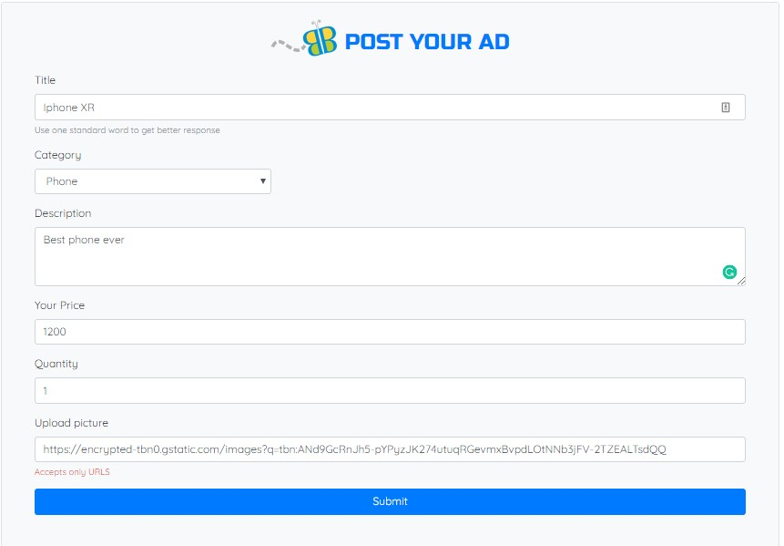

# Bargane

### Folder Structure

```
├── config
|  ├── middelware
|  |  └── isAuthenticated.js
|  └── config.js
|  └── passport.js
└── controllers
|   └── authController.js
|   └── headerController.js
|   └── html-routesController.js
|   └── postAdsController.js
|   └── productController.js
|   └──profileController.js
|   └── searchController.js
|   └── userAdsController.js
└── models
|   └── ads.js
|   └── index.js
|   └── profile.js
|   └──user.js
└── public
|   ├── css
|   |    └──style.css
|   ├── images
|   └── js
|       └── ad-display.js
|       └── login.js
|       └── signup.js
└── views
|   ├── layouts
|   |    └──main.handlebars
|   ├── partials
|   |   └── header.heandlebars
|   |   └── header-brand.heandlebars
|   |   └── footer.heandlebars
|   └── index.heandlebars
|   └── login.heandlebars
|   └── post-ads.heandlebars
|   └── product-display.heandlebars
|   └── profile.heandlebars
|   └── search.heandlebars
|   └── sign-up.heandlebars
|   └── user-ads.heandlebars
|   └── user-from.heandlebars
└── server.js
```

### Preview

Bargane is a `Market Place` app where people can feature their personal belongings for their desired price.

### Features & Description

1.  Bargane has functional authentication built with `passport.js`

    - Auth. schema used is `username & password`
      

2.  Customized user information page to get their personal information for app use purpose.

    - The page has restrictions as a user needs to fill user form as soon as they signup.
      

3.  User can `add | edit | delete` products with their price description and image URL.
    

        - They can only add if authenticated.
            

4.  Products available can be searched using the search bar and also could be found by clicking categories available.
    
    - on search or click, the user can only see the product add without user information if not authenticated.
      

5)  User can update their personal information if the user is authenticated. Their `name, email, and number` will be shared on their adds


### Technologies used

```
    JavaScript, jQuery, Node, Express, Sequelize, MySQL, Ajax, Rest API's, Passport, HTML5, CSS3, Bootstrap
```
